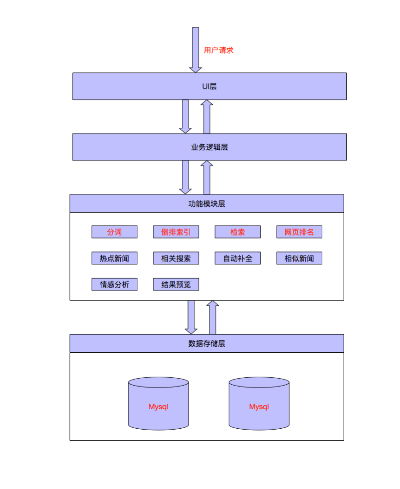

# NIR
* NIR means News Information Retrieval, which is a search engine that can help you search news and comment. NIR include more than 100k web pages.
* The project is deployed on Aliyun, you can visit it via [http://123.57.35.217:8888](http://123.57.35.217:8888/search)
* Here are some functions of the project:
    * The architecture
        * 
    * The effects:
       * 
       * 
       * 
* To know more details, you can visit the design document.
* The project has 5 members: 
    * Yiming Cui
    * Wentao Zhou
    * Yuting Zou
    * Tao Zhang
    * Tangwen Qian
    

